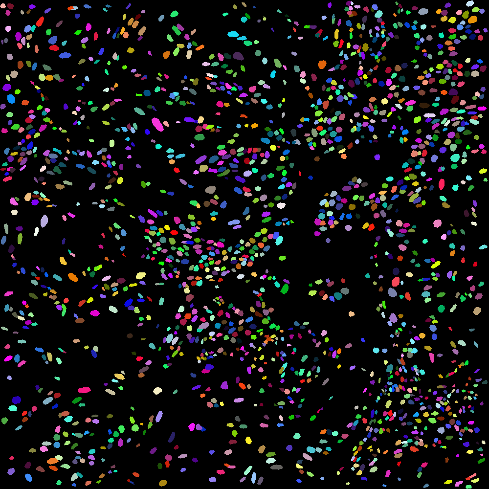

# Workflow for segmenting nuclei in digital pathology images

Uses pretrained StarDist model for cell segmentation.

### 1. Install QuPath & StarDist plugin

Qupath: https://qupath.github.io/ \
StarDist: https://github.com/qupath/qupath-extension-stardist \
Download pretrained model:
* H&E model = `he_heavy_augment.pb` https://github.com/qupath/models/tree/main/stardist

### 2. Run StarDist for nuclei segmentation

Within the QuPath script editor, change the local path to the model (modelPath) & run the script. Adjust the threshold as needed, adjust the selected region in QuPath as needed to exclude background/other regions.

`nuclei_seg_and_masking.groovy`

Outputs:
- an image of the original slide
- an image of the binary nuclei mask
- a GeoJSON file of the detected nuclei (for the next step)

### 3. Generate labeled mask image

Creates an image where each nuclei has a unique label (color), based on polygons in the GeoJSON file. Excludes cases at the edge of the image (nuclei that are cutoff).

`make_polygon_image.py`

### Example output

Original:

Binary mask:

Labeled mask:

